# Ovebot - AI Chatbot, Live Chat & AI Sales Agent for OpenCart

Official **[Ovebot.ai](https://ovebot.ai/)** integration for OpenCart, developed by **AWeb Design SRL**.

AI chatbot and live chat for your OpenCart store. Your AI agent recommends products, answers support questions and tracks orders 24/7. Free plan for the first 200 stores. No credit card.

## 🤖 The AI Chatbot That Actually Knows Your Store

Most chat extensions give you a box. Ovebot gives you an **AI sales agent** - one that has read your product catalog, your policies and your pages, and can hold a real conversation about them at 3 AM while you sleep.

Install the module, click **Start Free**, and in a couple of minutes your OpenCart store has a live chat widget backed by an AI chatbot that answers customer questions, recommends products that are actually in stock, and tells shoppers exactly where their order is - with the real tracking number.

No API keys. No copy-pasting scripts. No credit card to start.

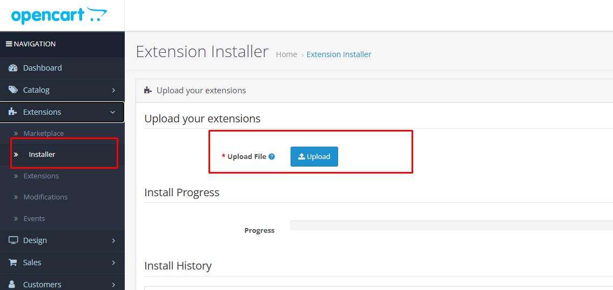

## 💸 Every Unanswered Question Is a Lost Sale

Your visitors ask the same things over and over: *Do you have this in blue? Is it in stock? Where's my order? What's your return policy?* Every one that goes unanswered walks away.

Ovebot answers all of it, instantly, in your customer's own language:

- ✅ **AI Sales Agent** - Understands what the shopper actually wants and recommends real products from your live OpenCart catalog, with images, prices and a click straight to the product page.
- ✅ **AI Customer Support** - Answers from your own knowledge base: shipping, returns, warranty, payment, anything you feed it.
- ✅ **Order Tracking Inside the Chat** - "Where is my order?" gets a real answer, with the actual order status and tracking number.
- ✅ **Live Chat With Handoff to a Human** - When a visitor wants a person, your team takes over the conversation in one click. Outside working hours the AI says so and leaves your contact details.
- ✅ **Never Shows Out-of-Stock Products** - Sold out or dropped from your feed? It disappears from chat automatically. Your AI never sells something you can't ship.

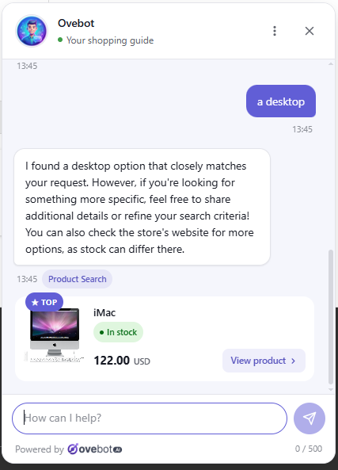

## 🧠 An AI Chatbot Trained on Your Business, Not the Internet

This is what separates Ovebot from a generic chatbot: it only speaks from **your** data.

- 🟢 **OpenCart Product Feed** - The module publishes your catalog with real-time stock and availability. The AI recommends from what's actually on the shelf, right now.
- 🟢 **Knowledge Base** - Build it from your own OpenCart Information pages with a click. In your Ovebot account you can also import any public URL or upload documents, and the AI reads them.
- 🟢 **Agent Memory** - A short, always-on note the AI reads at the start of every single conversation. Perfect for "Free shipping over 300 this week" or "We're closed for the holidays."
- 🟢 **SKU & Link Lookup** - A shopper pastes a product link or types a product code? The AI resolves it against your catalog and answers about that exact product - no guessing, no "sorry, I can't open links."
- 🟢 **Honest Answers** - When there's no exact match, Ovebot says so and offers the closest alternatives instead of pushing unrelated junk. Trust converts better than noise.

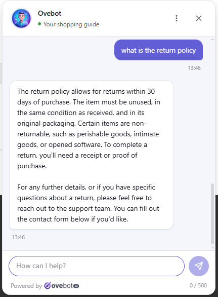

## 🌍 Speaks Your Customer's Language - Automatically

Set the widget language to `auto` and it detects the visitor's browser language on its own. If a visitor switches languages mid-conversation, the AI switches with them - the replies, the forms, even the verification emails follow along.

## 🛒 Built for OpenCart

- **Live catalog feed** with real-time stock and availability
- **Product recommendations in chat**, straight from your storefront, each linking to the real product page
- **Order tracking endpoint** that returns live order status and the tracking number
- **Purchase tracking snippet** on the checkout success page, linking real orders back to the conversations that produced them
- Works on **OpenCart 2.3.x and 3.x**

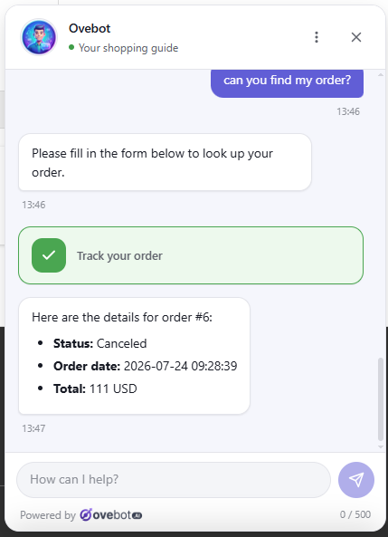

## 🎨 A Widget That Looks Like It Belongs on Your Site

Configure everything from the module's **Settings -> Appearance**, live on your storefront, no code needed:

- **Accent color & theme** - your brand color, light or dark
- **Subtitle & proactive message** - a teaser bubble that pops up after a delay you choose, turning silent browsers into conversations
- **Position** - left or right corner, with a vertical offset so it sits clear of your WhatsApp bubble or cookie banner
- **Language, sound & z-index** - full control, right down to the stacking order

Mobile-friendly out of the box.

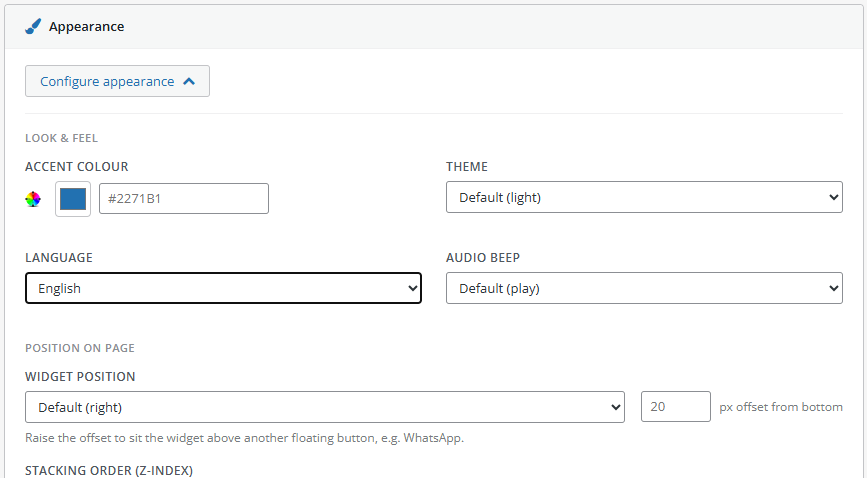

## 👥 Your Team, In Control - One Click Away in Your Ovebot Account

The module connects your store; the day-to-day chat operations live in your **Ovebot.ai account**, always one click from the OpenCart dashboard:

- **Live Sessions Dashboard** - see who's chatting right now, in real time
- **Take Over** - jump into any conversation; your name and avatar appear in the visitor's chat header. Click **Leave** and the AI picks up where you left off
- **Session History** - every transcript, searchable and filterable, with visitor country and linked orders
- **Browser notifications** - a pop-up and a beep the moment a visitor asks for a human
- **Roles & team invites** - Owners get settings, billing and statistics; Agents get the chat work, and teammates are never charged separately

## 📊 Proof That It's Working

In your Ovebot account:

- **Statistics** - sessions, messages split by visitor/AI/human, day by day
- **Activity Reports** - a friendly email with a PDF: conversations handled, **autonomy rate** (how much your AI resolved alone), estimated support hours saved, orders influenced and their value, and your top recommended products
- **Product Clicks** - a full log of every recommendation your customers clicked, ranked by popularity

## 🔐 GDPR-Ready, Seriously

Ovebot was built with EU privacy rules in the design, not bolted on:

- **AI disclosure + privacy notice** shown as the first message of every chat - visitors always know they're talking to an AI
- **Auto-generated privacy policy** naming you as data controller and Ovebot as processor - or link your own
- **Two first-party cookies only**, holding nothing but a random identifier
- **Visitors can download or permanently delete their conversation** at any time
- **Full workspace data export** delivered as a ZIP to your inbox

## ⚡ Fast, Because Slow Sites Don't Sell

The widget loads from a single lightweight script. Your OpenCart store stays fast, and your Core Web Vitals stay happy.

## 🆓 Free Plan - Early Access, First 200 Stores

Ovebot is in early access: the free plan is limited to the first 200 stores. It includes 100 AI replies per month, free forever. No credit card, no time limit, nothing to cancel.

Click **Start Free** in the setup wizard and you're running in minutes.

Want to see it before you even install? Paste your website URL at [demo.ovebot.ai](https://demo.ovebot.ai) and in about a minute you'll be chatting with an AI agent trained on your own site. No signup.

## 🛟 When You Get Busy, You Don't Lose Anyone

Hit your monthly message limit and the chat **does not shut off**. The widget switches to contact-collection mode: visitors leave their name, phone and message, and every one lands in your Requests inbox. A busy month turns into leads instead of a closed door. (Only the AI's replies count toward your limit - visitor messages and your team's manual replies are free.)

---

## Requirements

- OpenCart 2.3 or 3.x
- An [Ovebot.ai](https://ovebot.ai/) account - you can start on the free plan directly from the wizard, no credit card

## Installation

1. Download the module's `.zip` archive.
2. In the admin panel, go to **Extensions / Installer** and upload the `.zip` using **Upload File**.
3. Go to **Extensions / Extensions / Modules** (OpenCart 3) or **Extensions / Modules** (OpenCart 2.3) and open **Ovebot - AI Chatbot, Live Chat & AI Sales Agent**.

The connection uses **OAuth** - there are no API keys to copy and paste by hand.

## Initial setup (wizard)

The first time you open the module, a 4-step wizard connects your store to your Ovebot.ai account.

### Step 1 - Connect account

Log in to your Ovebot.ai account, or start on the free plan. You'll be sent to ovebot.ai to sign in, then brought straight back to the admin panel.

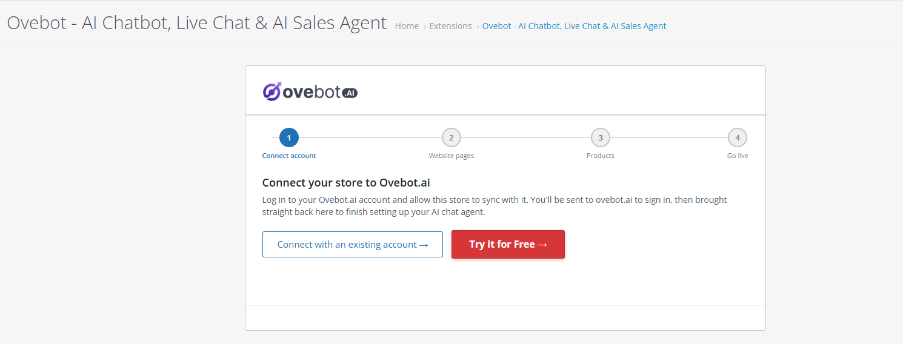

### Step 2 - Website pages

Pick the pages (About Us, Delivery, Returns, Terms & Conditions, etc.) your AI agent should read and answer from.

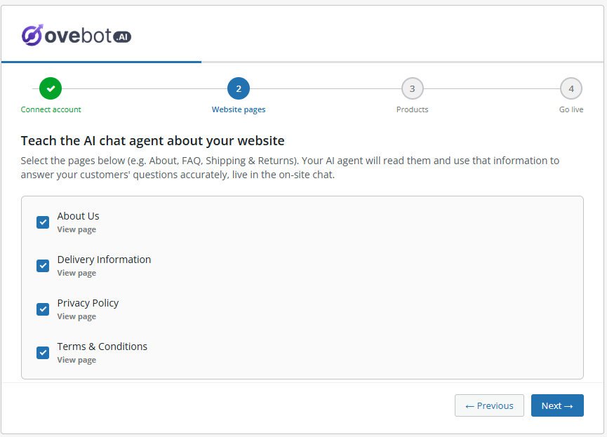

### Step 3 - Products

The module sends your product feed to Ovebot.ai so the agent can recommend from your live catalog - or you can provide your own feed, configured in your Ovebot.ai account.

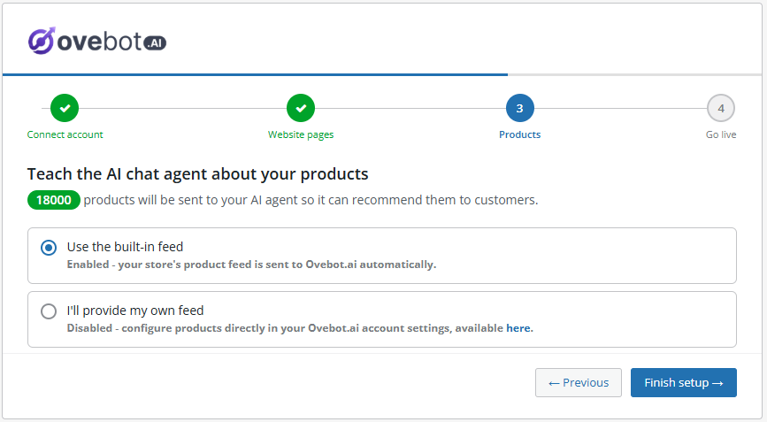

### Step 4 - Go live

Setup finishes and the AI agent goes live on your site immediately.

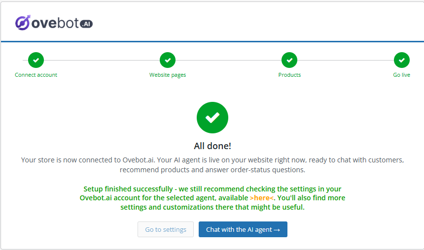

## Dashboard

Once setup is complete, the module's main screen becomes a dashboard showing your connection status, quick links to chat with the agent or open your Ovebot.ai account, the number of products indexed by the AI, and your synced knowledge bases - each with a direct link to edit the entry on Ovebot.ai, so managing your resources stays one click away.

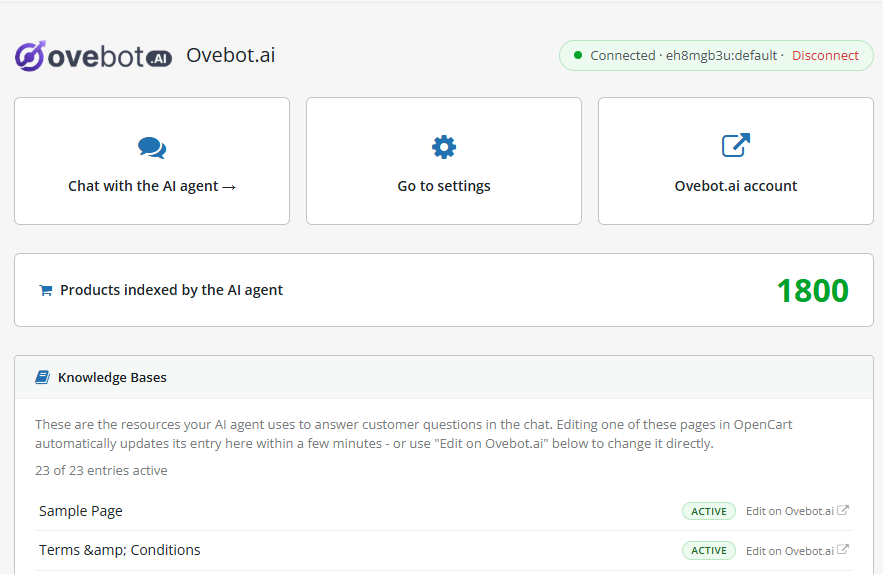

## Chat widget on the storefront

Once enabled, the chat widget appears on every page of your store: product search and recommendations, answers from your knowledge base, and live order tracking.

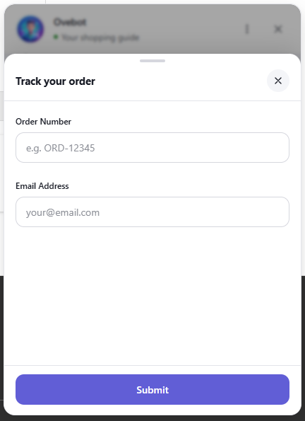

## Frequently Asked Questions

**Does Ovebot cost anything to try?**
No. The free plan is free forever and includes 100 AI replies per month, with no credit card and no time limit. Early access: the free plan is available to the first 200 stores. Paid plans with higher limits are available anytime at ovebot.ai.

**Do I need an Ovebot.ai account?**
Yes, but you can create one without leaving OpenCart. The setup wizard lets you start on the free plan directly - no credit card, no separate signup on the website.

**How is this different from a normal live chat extension?**
A normal live chat waits for you to be online. Ovebot's AI agent answers on its own - from your real product catalog and your own pages - 24/7, and only pulls in a human when the conversation actually needs one.

**Where does the AI get its answers from?**
Only from your data: your OpenCart catalog, your knowledge base (Information pages, imported URLs, uploaded documents) and your Agent Memory. It doesn't browse the web and invent answers.

**Can the AI recommend products that are out of stock?**
No. When a product runs out of stock or drops out of your feed, Ovebot removes it automatically, so it stops appearing in chat search and recommendations. If it comes back in stock, it reappears.

**Can my team take over a conversation from the AI?**
Yes, from your Ovebot.ai account. Click **Take Over** on any session, reply directly, then click **Leave** and the AI resumes automatically.

**What happens when I hit my monthly message limit?**
The chat stays on your site and switches to contact-collection mode: visitors leave their details and every submission lands in your Requests inbox. Only the AI's replies count toward your limit - visitor messages and your team's manual replies are free.

**Can I try it before installing?**
Yes. Paste your website URL at [demo.ovebot.ai](https://demo.ovebot.ai) and about a minute later you'll be chatting with an AI agent trained on your own site content. No signup required.

## 🚀 Get Started in Minutes

1. Install and activate the module.
2. Start free from the setup wizard - or connect your existing Ovebot account with one click.
3. Pick your pages for the knowledge base, style your widget, and go live.

Your AI sales agent is on duty tonight. Install Ovebot and stop losing the customers you already paid to bring to your site.

See all plans and pricing on the [Ovebot.ai website](https://ovebot.ai).

## Support

- Website: [https://ovebot.ai/](https://ovebot.ai/)
- Contact: [office@awebdesign.ro](mailto:office@awebdesign.ro)
- Developer: **AWeb Design SRL**

## Changelog

### 1.1.0

- Add to cart from chat: new "Add to cart button" setting, synced with your Ovebot.ai account. Recommended products can be added to the cart straight from the conversation, and the chat follows the visitor's cart.
- Product feed: new optional `sku`, `gtin` (from the product's EAN) and `additional_image_link` columns.
- Purchase tracking now sends the ordered items, with amounts in the order's own currency.

### 1.0.0

- Initial release.
